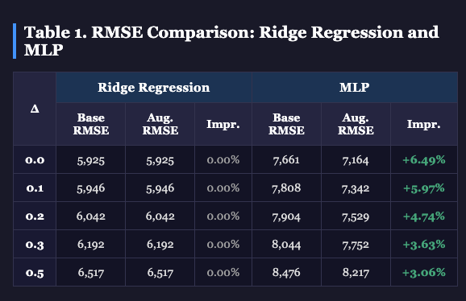
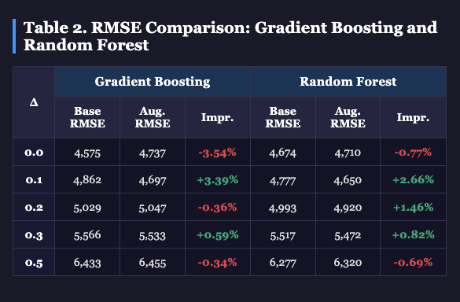
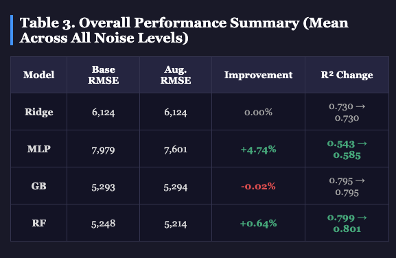

# Fuzzy Feature Augmentation for Privacy-Preserving Machine Learning: Improving Model Robustness Under Noise Perturbation

A research project investigating whether fuzzy c-means membership values can improve machine learning model robustness under differential privacy noise. Presented at **NAFIPS 2026**.

**Authors:** John Cavanaugh, Tri Nguyen, Dr. Kelly Cohen
**Institution:** University of Cincinnati — AI BIO Lab

📄 [Read the paper](paper/Cavanaugh_Nguyen_Cohen_NAFIPS2026.pdf)

> Code is private pending publication. Paper available on request.

---

## The Problem

Differential privacy protects individual records by injecting calibrated Gaussian noise into training data before model fitting. The tradeoff is well known: stronger privacy (smaller ε) means more noise, which degrades model accuracy.

The question: can fuzzy c-means membership values — which encode the local geometric structure of the data — act as a noise-resilient secondary signal that helps models recover some of that lost accuracy?

---

## Hypothesis

Fuzzy c-means assigns every data point a soft membership degree to each cluster. These membership values reflect where each point sits relative to the cluster landscape. The hypothesis is that this geometric encoding is more stable under Gaussian noise than raw feature values — because even when features are perturbed, the relative distances to cluster centers change only gradually.

If true, appending membership values to the original features should improve model performance under noise, particularly for non-linear models that can exploit the soft cluster structure.

---

## Methodology

**Dataset:** Medical Cost Personal Dataset (insurance.csv) — 1,338 records, features including age, BMI, smoking status, region, and number of children. Target variable: annual insurance charges. After one-hot encoding: 11-dimensional input space.

**Privacy mechanism:** Gaussian noise calibrated to (ε, δ)-differential privacy:

σ = Δf · √(2 ln(1.25/δ)) / ε

With ε=1, δ=10⁻⁵, sensitivity Δf varied across noise levels.

**Fuzzy augmentation:** Fuzzy C-Means with c=12 clusters and fuzziness m=2.5. Cluster centroids learned on training data only. Each sample's 12 membership values appended to original features, producing a 23-dimensional augmented input vector:

x'ᵢ = [xᵢ, μᵢ₁, μᵢ₂, …, μᵢ₁₂]

**Models compared:** Each of four model families trained in two versions — baseline and fuzzy-augmented:
- Ridge Regression (linear baseline)
- MLP (128→64→32, adaptive learning rate, early stopping)
- Gradient Boosting (200 estimators, max depth 5)
- Random Forest (200 estimators, max depth 15)

**Experimental protocol:** 5 trials per noise level, mean RMSE reported. Noise levels: Δf ∈ {0.0, 0.1, 0.2, 0.3, 0.5}.

---

## A Note on Results

The tables above reflect a reproduced experiment using a wider noise range (Δf ∈ {0.0, 0.1, 0.2, 0.3, 0.5}) compared to the original paper (Δf ∈ {0.0, 0.01, 0.02, 0.03, 0.05}). The core conclusions are consistent across both ranges — MLP benefits most from fuzzy augmentation, Ridge shows no benefit, and GB and RF show mixed results. The wider noise range reveals that MLP's improvement is highest at low noise and decreases gradually as noise increases, which is an additional finding not captured in the original submission.

For the exact results reported in the paper, refer to the PDF in `/paper/`.

---

## Results

**Table 1. RMSE Comparison: Ridge Regression and MLP**



| Δ | Ridge Base | Ridge Aug. | Ridge Impr. | MLP Base | MLP Aug. | MLP Impr. |
|---|-----------|-----------|-------------|----------|----------|-----------|
| 0.0 | 5,925 | 5,925 | 0.00% | 7,661 | 7,164 | **+6.49%** |
| 0.1 | 5,946 | 5,946 | 0.00% | 7,808 | 7,342 | **+5.97%** |
| 0.2 | 6,042 | 6,042 | 0.00% | 7,904 | 7,529 | **+4.74%** |
| 0.3 | 6,192 | 6,192 | 0.00% | 8,044 | 7,752 | **+3.63%** |
| 0.5 | 6,517 | 6,517 | 0.00% | 8,476 | 8,217 | **+3.06%** |

**Table 2. RMSE Comparison: Gradient Boosting and Random Forest**



| Δ | GB Base | GB Aug. | GB Impr. | RF Base | RF Aug. | RF Impr. |
|---|---------|---------|----------|---------|---------|----------|
| 0.0 | 4,575 | 4,737 | -3.54% | 4,674 | 4,710 | -0.77% |
| 0.1 | 4,862 | 4,697 | **+3.39%** | 4,777 | 4,650 | **+2.66%** |
| 0.2 | 5,029 | 5,047 | -0.36% | 4,993 | 4,920 | **+1.46%** |
| 0.3 | 5,566 | 5,533 | **+0.59%** | 5,517 | 5,472 | **+0.82%** |
| 0.5 | 6,433 | 6,455 | -0.34% | 6,277 | 6,320 | -0.69% |

**Table 3. Overall Performance Summary (Mean Across All Noise Levels)**



| Model | Base RMSE | Aug. RMSE | Improvement | R² Change |
|-------|-----------|-----------|-------------|-----------|
| Ridge | 6,124 | 6,124 | 0.00% | 0.730 → 0.730 |
| MLP | 7,979 | 7,601 | **+4.74%** | 0.543 → 0.585 |
| GB | 5,293 | 5,294 | -0.02% | 0.795 → 0.795 |
| RF | 5,248 | 5,214 | **+0.64%** | 0.799 → 0.801 |

---

## Key Findings

**MLP benefits most (+4.74% RMSE improvement).** The MLP's non-linear representational capacity allows it to exploit the soft cluster geometry encoded in the membership values. The fuzzy features provide a secondary signal that persists even as raw features are corrupted by noise.

**Ridge shows zero benefit.** Linear models cannot exploit non-linear membership features — the augmented dimensions add no predictive value to a model that can only learn linear relationships.

**GB shows negligible change (-0.02%).** Gradient boosting's sequential tree-building process is sensitive to the addition of correlated features. The membership values, which are correlated with the original features by construction, may introduce spurious early splits.

**RF shows modest gains (+0.64%).** Random Forest's ensemble averaging and feature subsampling provide some robustness to the additional correlated features, allowing modest exploitation of the membership structure.

**The benefit is architecture-dependent.** Fuzzy augmentation is not a universal improvement — it is a targeted technique for non-linear models, particularly MLPs, operating under Gaussian noise perturbation.

---

## Why Fuzzy Logic

Fuzzy c-means produces soft, graded cluster memberships that reflect the geometric neighborhood structure of each data point. Unlike hard cluster assignments, these values change continuously and gradually under feature perturbation — making them more stable under noise than the original features.

This connects to a broader principle in explainable AI: fuzzy representations encode human-interpretable structure (linguistic clusters like "low," "medium," "high") while providing mathematical properties useful for robust learning. The UC AI BIO Lab's focus on explainable AI for mission-critical systems motivates this line of research directly.

---

## Note

findings are a bit different from the paper beacause a random.seed was not used (silly goose me), but this gives similar and consistent results as the NAFIPS paper

---

## Citation

```
Cavanaugh, J., Nguyen, T., & Cohen, K. (2026). Fuzzy Feature Augmentation 
for Privacy-Preserving Machine Learning: Improving Model Robustness Under 
Noise Perturbation. Presented at NAFIPS 2026.
University of Cincinnati AI BIO Lab.
```

---

## License

MIT License. See `LICENSE` for details.

---

## Author Contact

**John Cavanaugh**
PhD Candidate, Aerospace Engineering
University of Cincinnati — AI BIO Lab
Advisor: Dr. Kelly Cohen

[LinkedIn](https://www.linkedin.com/in/privacy-evangelist/) · [Email](johnthecavanaugh@gmail.com)
